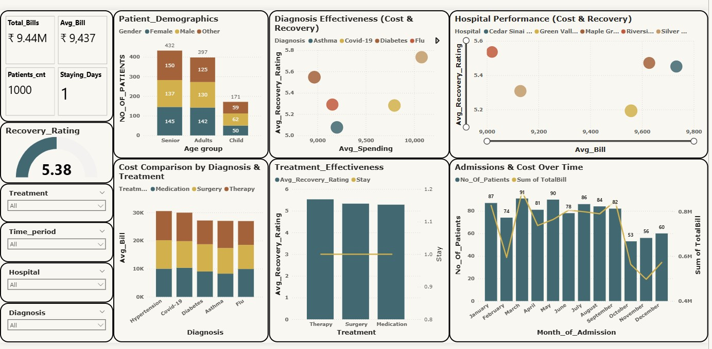

# Healthcare Dashboard Analysis: Insights & Recommendations

## Key Performance Indicators

- **Total Bills**: ₹9.44M  
- **Average Bill**: ₹9,437  
- **Patient Count**: 1,000  
- **Average Stay**: 1 day  
- **Overall Recovery Rating**: 5.38 (moderate)

---

## Dashboard Insights

### 1. Patient Demographics
- Largest segment: Seniors (432), followed by adults (397), and children (171)
- Gender distribution is balanced across age groups
- **Implication**: Prioritize elderly care in service planning

### 2. Treatment Effectiveness
- Therapy shows highest recovery ratings and cost efficiency
- Surgery and medication demonstrate lower recovery-to-cost ratios
- **Recommendation**: Expand therapy-based treatment protocols where appropriate

### 3. Hospital Performance Comparison
- Notable differences in cost-to-recovery ratios between hospitals
- Riverside Hospital excels in recovery at moderate cost
- Green Valley Medical Center shows higher bills with lower recovery
- **Action**: Share best practices from high-performing hospitals system-wide

### 4. Diagnosis Cost-Effectiveness
- Hypertension and COVID-19 have highest treatment costs
- Chronic conditions (diabetes, asthma) show moderate costs with lower recovery ratings
- **Strategy**: Create specialized care pathways for chronic conditions

### 5. Operational Patterns
- Seasonal admission peaks in March-May, declines in November-December
- **Recommendation**: Use dynamic staffing and resource allocation for predictable demand

---

## Business Recommendations (Simple Points)

1. **Standardize Best Practices**: Learn from high-performing hospitals to improve overall outcomes.
2. **Increase Therapy Use**: Where possible, prioritize therapy for better recovery and cost efficiency.
3. **Specialized Chronic Care**: Develop programs for diabetes, asthma, and hypertension patients.
4. **Seasonal Planning**: Adjust staff and resources based on known admission peaks and dips.
5. **Senior Care Focus**: Allocate more resources and design services for elderly patients.
6. **Review Medication Protocols**: Ensure expensive medications are prescribed only when clearly beneficial.
7. **Monitor Cost vs. Recovery**: Regularly analyze cost and recovery data to refine treatment strategies.
8. **Patient Education**: Educate patients on cost-effective treatments and recovery expectations.

---

## Question-wise Answers

**Q1. Which patient group needs the most care?**  
_Seniors are the largest group and need the most healthcare resources._

**Q2. Which treatment is most effective?**  
_Therapy has the highest recovery rating and is cost-effective._

**Q3. Are costs and recovery rates balanced across hospitals?**  
_No, some hospitals like Riverside are more efficient, while others need improvement._

**Q4. What diagnoses are most expensive?**  
_Hypertension and COVID-19 have the highest costs; chronic diseases require better management._

**Q5. Is there a seasonal pattern in admissions?**  
_Yes, admissions peak in March-May and drop in November-December._

**Q6. How can hospital performance improve?**  
_Standardizing best practices, prioritizing therapy, and improving chronic care can boost outcomes and efficiency._

---

> These insights and recommendations will help guide strategic decisions to improve healthcare delivery and operational efficiency.
